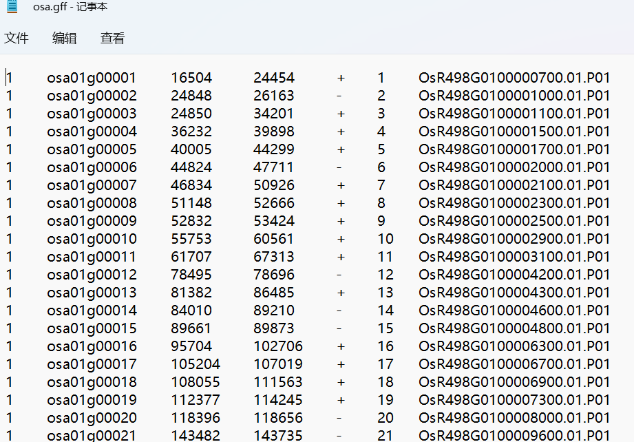
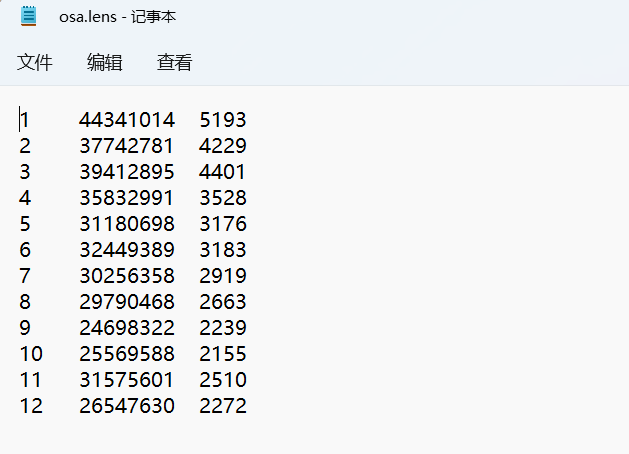
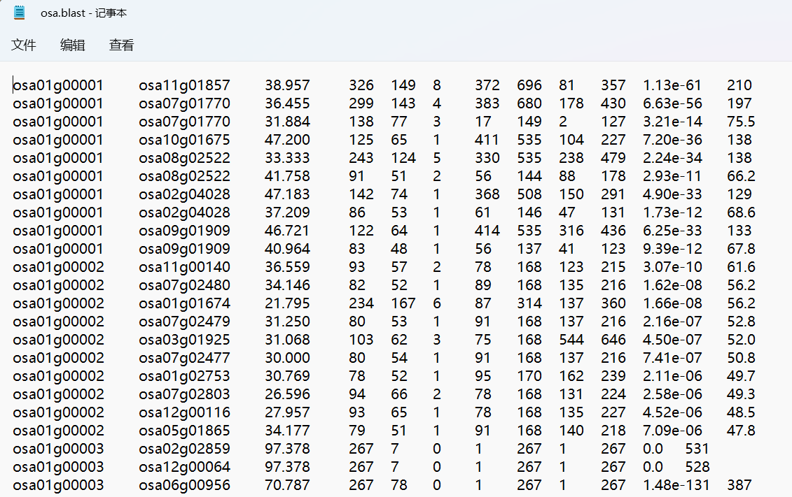
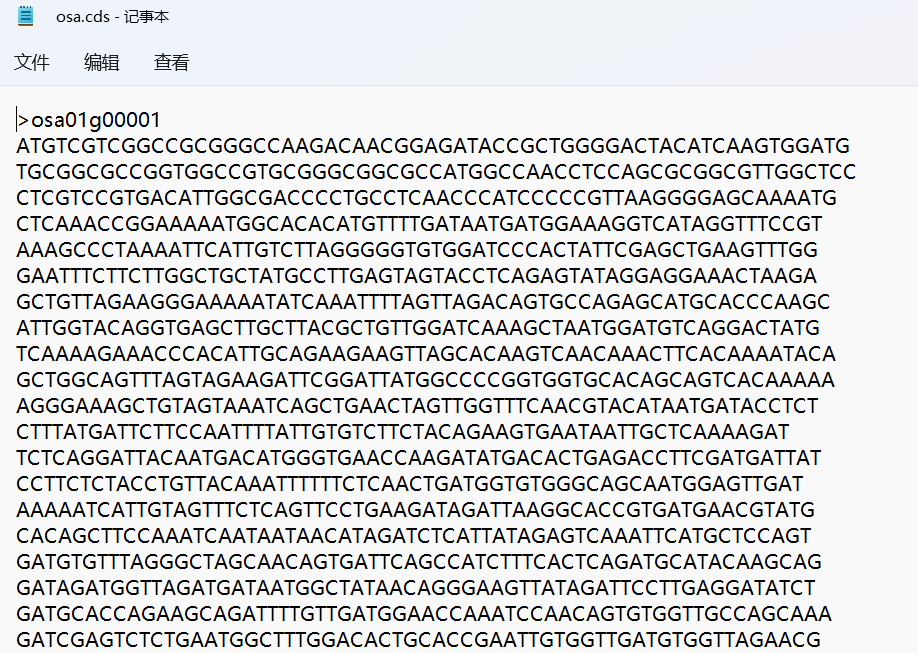
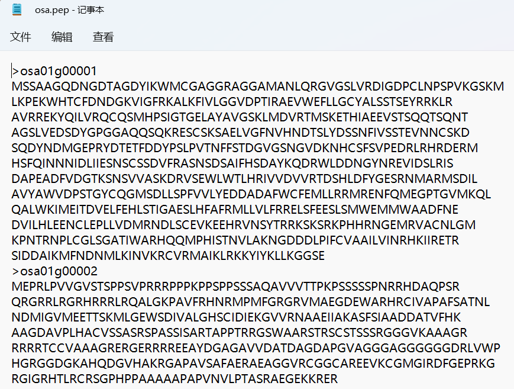
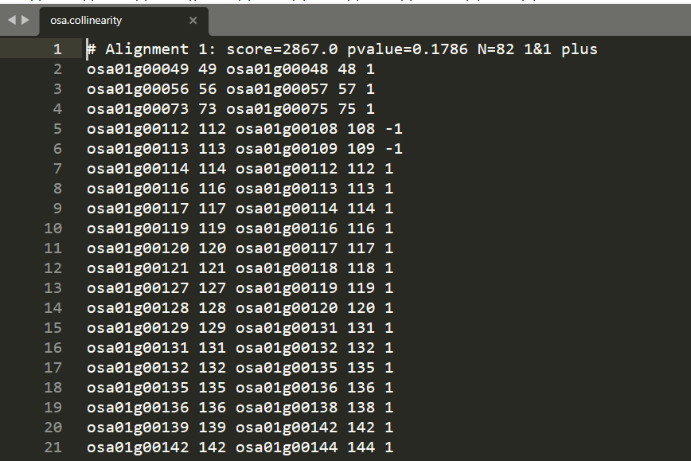
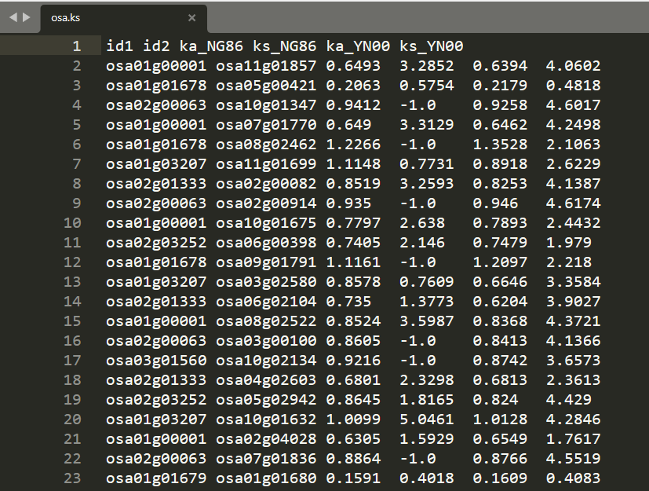
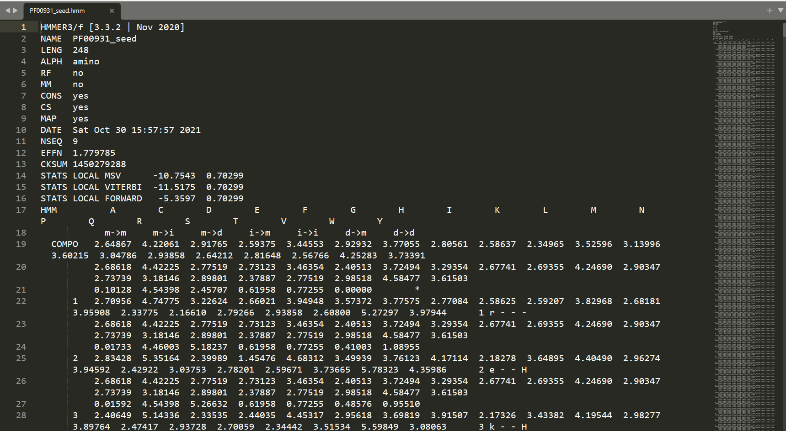
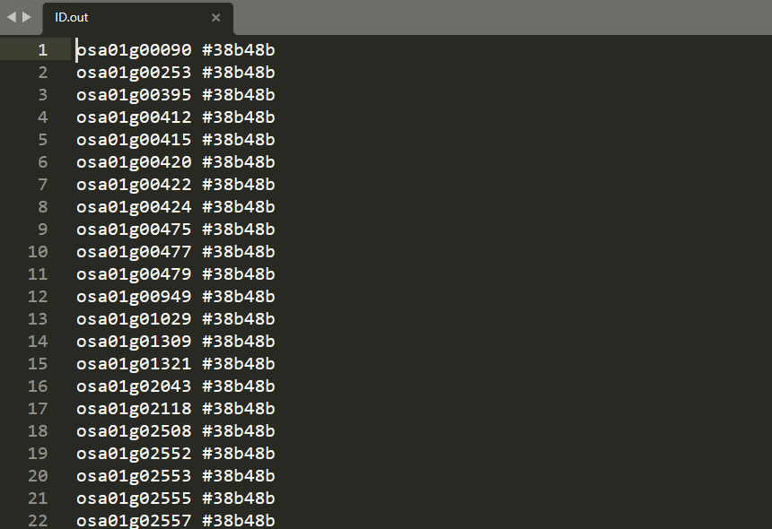

[](https://doi.org/10.5281/zenodo.15910591)

# famCircle 基因家族分析，tandem可视化分析

## At present there is no detailed manual for this application, you will simply have to play around and see what happens.

## 分析流程

>基因组下载以及处理  
>路线：  
>>前期处理序列比对、比对结果过滤、共线性扫描、ks计算  
>>hmmer 隐马尔可夫模型搜索筛选  
>>screen tandem数量分部  
>>主程序选择：  
>>>inner  
>>>>typing 数据格式化  
>>>>inner绘图  

>>>outer  
>>>>typing 数据格式化  
>>>>outer绘图  

>>part局部tandem绘制  

>家族成员复制类型区分：  
>>共线性过滤
>>>串联复制
>>>近端重复
>>>全基因组加倍
>>>转座复制
>>>散在复制

>>ks展示  
>>>全基因组 ks展示  
>>>block ks展示  
>>>circle全基因组共线性展示  
>>>line局部共线性绘制  

# 软件安装与使用
## 下载安装
### 从https://github.com/lkiko/famCircle/ 下载安装包到本地安装
&ensp;&ensp;&ensp;&ensp;命令  
```
pip install xx/xx/famCircle-*.*.*.tar.gz
pip install xx/xx/famCircle-*.*.*-py3-none-any.whl
```

### 直接通过pip安装
&ensp;&ensp;&ensp;&ensp;命令 

```
pip install famCircle
```

## 软件配置
安装路径下/famCircle/conf.ini


```
[ini]
hmmer_path = ~/bin/
# hmm安装路径
clustalw_path = ~/bin/clustalw
#clustalw安装路径
muscle_path = ~/bin/muscle
#muscle安装路径
mafft_path = ~/bin/mafft
#mafft安装路径
yn00_path = ~/bin/yn00
#paml安装路径
pal2nal_path = ~/bin/pal2nal.pl
#pal2nal安装路径
```
## 软件使用

### help

```
famCircle -h
```
### 文件配置 以outer为例

```
famCircle -o ? > total.conf# 覆盖
famCircle -o ? >> total.conf# 追加
```
### 常用文件示例
#### gff文件

&ensp;&ensp;&ensp;&ensp;gff文件从左至右依次是    
&ensp;&ensp;&ensp;&ensp;染色体  基因名  开始位置  结束位置  正负链  基因在染色体上的相对位置  备注    
#### lens文件
  
&ensp;&ensp;&ensp;&ensp;lens文件从左至右依次为    
&ensp;&ensp;&ensp;&ensp;染色体  染色体碱基数  染色体基因数    
#### blast文件
  
&ensp;&ensp;&ensp;&ensp;blast文件使用常见的M8格式    
#### cds文件和pep文件

  
&ensp;&ensp;&ensp;&ensp;cds文件为基因的核酸序列，pep文件为基因对应的蛋白质序列    
&ensp;&ensp;&ensp;&ensp;两个文件均为fasta格式    
#### 共线性文件
  
&ensp;&ensp;&ensp;&ensp;示例共线性文件为[WGDI 共线性结果](http://wgdi.readthedocs.io/en/latest/collinearity.html)格式的共线性结果文件，同时软件还兼容MCScanX的共线性扫描结果    
#### ks文件
  
&ensp;&ensp;&ensp;&ensp;软件兼容[WGDI ks计算结果](http://wgdi.readthedocs.io/en/latest/ks.html)，同时软件兼容自身ks计算模块的计算结果
#### HMM(隐马尔可夫模型)文件
  
&ensp;&ensp;&ensp;&ensp;软件使用[PFAM 的基因家族隐马尔可夫模型](http://pfam.xfam.org/)  
#### 家族文件
  
&ensp;&ensp;&ensp;&ensp;基因家族文件产生自本软件，初始文件只有第一列为，目标基因家族成员。再经过家族成员分类之后，手动添加第二列为颜色(不同的类别赋予不同的颜色)
### 功能使用 以outer为例

```
famCircle -o total.conf
```

# 配置文件解释   
&ensp;&ensp;&ensp;&ensp;因为gitee图片限制，以下例图来源于程序截图，程序生成的图像分辨率远高于例图  

#### [filter_unit]# 过滤blast文件  
&ensp;&ensp;&ensp;&ensp;blast = old blast file# 旧blast文件  
&ensp;&ensp;&ensp;&ensp;number = 10#非自身最佳匹配树  
&ensp;&ensp;&ensp;&ensp;outfile = new blast file# 输出文件  

#### [circle_all]# 共线性圈图  
&ensp;&ensp;&ensp;&ensp;lens1 = lens1 file#物种1的染色体长度文件  
&ensp;&ensp;&ensp;&ensp;lens2 = lens2 file#物种2的染色体长度文件  
&ensp;&ensp;&ensp;&ensp;gff1 = gff1 file#物种1的gff文件  
&ensp;&ensp;&ensp;&ensp;gff2 = gff2 file#物种2的gff文件  
&ensp;&ensp;&ensp;&ensp;genepairs = block file#物种间共线性比对文件  
&ensp;&ensp;&ensp;&ensp;genepairsfile_type = MCScanX#支持MCScanX、ColinearScan输出结果    
&ensp;&ensp;&ensp;&ensp;block = 6#共线性片段最小长度  
&ensp;&ensp;&ensp;&ensp;savefile = save file (*.png, *.pdf)#输出格式  


#### [line]#局部共线性图  
&ensp;&ensp;&ensp;&ensp;genepairs = pairs file  
&ensp;&ensp;&ensp;&ensp;genepairsfile_type = WGDI#支持WGDI输出结果  
&ensp;&ensp;&ensp;&ensp;lens1 = lens1 file#物种1染色体长度文件  
&ensp;&ensp;&ensp;&ensp;lens2 = lens2 file#物种2的染色体长度文件  
&ensp;&ensp;&ensp;&ensp;gff1 =  gff1 file#物种1的gff文件  
&ensp;&ensp;&ensp;&ensp;gff2 =  gff2 file#物种2的gff文件  
&ensp;&ensp;&ensp;&ensp;chr1_name =  chr1 name#染色体名  
&ensp;&ensp;&ensp;&ensp;chr2_name =  chr2 name  
&ensp;&ensp;&ensp;&ensp;savefile = savefile(.png,.pdf)#支持输出.png，.pdf格式  


#### [Ks]# 多进程计算Ks  
&ensp;&ensp;&ensp;&ensp;cds_file = 	cds file  
&ensp;&ensp;&ensp;&ensp;pep_file = 	pep file  
&ensp;&ensp;&ensp;&ensp;align_software = muscle#调用muscle进行多序列比对  
&ensp;&ensp;&ensp;&ensp;pairs_file = gene pairs file#基因对文件  
&ensp;&ensp;&ensp;&ensp;ks_file = ks result  

#### [Ks_block]# 共线性同源基因块ks核密度图  
&ensp;&ensp;&ensp;&ensp;ks = ks file#输入ks文件  
&ensp;&ensp;&ensp;&ensp;area = 0,2.5  
&ensp;&ensp;&ensp;&ensp;model = YN00/NG86  
&ensp;&ensp;&ensp;&ensp;genepairs = block file  
&ensp;&ensp;&ensp;&ensp;genepairsfile_type = WGDI  
&ensp;&ensp;&ensp;&ensp;block = 6  
&ensp;&ensp;&ensp;&ensp;savefile = save file (*.png, *.pdf)  


#### [circle]#共线性ks圈图  
&ensp;&ensp;&ensp;&ensp;lens1 = lens1 file  
&ensp;&ensp;&ensp;&ensp;lens2 = lens2 file  
&ensp;&ensp;&ensp;&ensp;gff1 = gff1 file  
&ensp;&ensp;&ensp;&ensp;gff2 = gff2 file  
&ensp;&ensp;&ensp;&ensp;genepairs = genepairs file  
&ensp;&ensp;&ensp;&ensp;genepairsfile_type = MCScanX  
&ensp;&ensp;&ensp;&ensp;ks = ks file  
&ensp;&ensp;&ensp;&ensp;Ks_concern = 0,1.5#ks范围  
&ensp;&ensp;&ensp;&ensp;block = 6  
&ensp;&ensp;&ensp;&ensp;savefile = save file (*.png, *.pdf)  


#### [hmmer]#鉴定基因家族  
&ensp;&ensp;&ensp;&ensp;pep = pep file#物种蛋白质文件  
&ensp;&ensp;&ensp;&ensp;cds = cds file#物种cds文件  
&ensp;&ensp;&ensp;&ensp;hmmmoldpath = hmm file#存放基因家族HMM模型路径  
&ensp;&ensp;&ensp;&ensp;format_conversion = Fales  
&ensp;&ensp;&ensp;&ensp;comparison = clustal#调用多序列比对工具  
&ensp;&ensp;&ensp;&ensp;e_value1 = value1#设置阈值构建物种特异性hmm文件  
&ensp;&ensp;&ensp;&ensp;e_value2 = value2#设置阈值筛选基因家族候选序列  

#### [circle_family]#基因家族分布图  
&ensp;&ensp;&ensp;&ensp;lens = lens file  
&ensp;&ensp;&ensp;&ensp;gff = gff file  
&ensp;&ensp;&ensp;&ensp;genepairs = block file  
&ensp;&ensp;&ensp;&ensp;genepairsfile_type = MCScanX  
&ensp;&ensp;&ensp;&ensp;genefamily = family file#基因家族候选序列文件   
&ensp;&ensp;&ensp;&ensp;block = 6  
&ensp;&ensp;&ensp;&ensp;savefile = save file (*.png, *.pdf)  
 

#### [screen]#基因家族亚家族数量分布图  
&ensp;&ensp;&ensp;&ensp;domainpath = domain file#hmmsearch结果文件路径  
&ensp;&ensp;&ensp;&ensp;lens = lens file  
&ensp;&ensp;&ensp;&ensp;gff = gff file  
&ensp;&ensp;&ensp;&ensp;chro_name = chro name#染色体名称  
&ensp;&ensp;&ensp;&ensp;series = 25#  
&ensp;&ensp;&ensp;&ensp;outpath = out file 


#### [typing]  
&ensp;&ensp;&ensp;&ensp;domainpath = domain file  
&ensp;&ensp;&ensp;&ensp;domainlist = Genome name  
&ensp;&ensp;&ensp;&ensp;savefile = out file  

#### [outer]#基因家族全部成员分布及tandem外圈图  
&ensp;&ensp;&ensp;&ensp;lens = lens file  
&ensp;&ensp;&ensp;&ensp;gff = gff file  
&ensp;&ensp;&ensp;&ensp;ks = ks file  
&ensp;&ensp;&ensp;&ensp;pair_file = pair file  
&ensp;&ensp;&ensp;&ensp;file_type = WGDI/BLAST#支持WGDI、BLAST输出文件  
&ensp;&ensp;&ensp;&ensp;genefamily = famliy file#候选基因家族成员文件  
&ensp;&ensp;&ensp;&ensp;Ks_concern = 0,0.15#ks值范围  
&ensp;&ensp;&ensp;&ensp;cluster = 16#簇间距  
&ensp;&ensp;&ensp;&ensp;parameter = False  
&ensp;&ensp;&ensp;&ensp;savecsv = out file (*.csv)  
&ensp;&ensp;&ensp;&ensp;savefile = save file (*.png, *.pdf)   


#### [inner]#基因家族分布及tandem内圈图
&ensp;&ensp;&ensp;&ensp;lens = lens file  
&ensp;&ensp;&ensp;&ensp;gff = gff file  
&ensp;&ensp;&ensp;&ensp;ks = ks file  
&ensp;&ensp;&ensp;&ensp;pair_file = pair file  
&ensp;&ensp;&ensp;&ensp;file_type = WGDI/BLAST#支持WGDI、BLAST输出文件  
&ensp;&ensp;&ensp;&ensp;genefamily = famliy file#候选基因家族成员文件  
&ensp;&ensp;&ensp;&ensp;Ks_concern = 0,0.15  
&ensp;&ensp;&ensp;&ensp;cluster = 16  
&ensp;&ensp;&ensp;&ensp;relation = False  
&ensp;&ensp;&ensp;&ensp;savecsv = out file (*.csv)  
&ensp;&ensp;&ensp;&ensp;savefile = save file (*.png, *.pdf)  


#### [part]#基因家族局部共线性图  
&ensp;&ensp;&ensp;&ensp;lens = lens file  
&ensp;&ensp;&ensp;&ensp;gff = gff file  
&ensp;&ensp;&ensp;&ensp;chro_name = chro name  
&ensp;&ensp;&ensp;&ensp;genefamily = famliy file  
&ensp;&ensp;&ensp;&ensp;pairs_file = outer/inner pairs csv  
&ensp;&ensp;&ensp;&ensp;interval = 0,9000  
&ensp;&ensp;&ensp;&ensp;space = 0.005  
&ensp;&ensp;&ensp;&ensp;clusters = True  
&ensp;&ensp;&ensp;&ensp;savefile = save file (*.png, *.pdf)  
&ensp;&ensp;&ensp;&ensp;修改中  

#### [filterWGD]#  
&ensp;&ensp;&ensp;&ensp;gff = gff file  
&ensp;&ensp;&ensp;&ensp;ks = ks file  
&ensp;&ensp;&ensp;&ensp;min_ks = .0/0./other  
&ensp;&ensp;&ensp;&ensp;colinearity_file = colinearity file  
&ensp;&ensp;&ensp;&ensp;colinearity_type = WGDI/ColinearScan  
&ensp;&ensp;&ensp;&ensp;block = 10  
&ensp;&ensp;&ensp;&ensp;multiple = multiple  
&ensp;&ensp;&ensp;&ensp;area1 = min,max  
&ensp;&ensp;&ensp;&ensp;savefile = save file (WGD colinearity file) 

#### [tandem]#串联重复分布图  
&ensp;&ensp;&ensp;&ensp;lens = lens file  
&ensp;&ensp;&ensp;&ensp;gff = gff file  
&ensp;&ensp;&ensp;&ensp;pair_file = pair file  
&ensp;&ensp;&ensp;&ensp;file_type = BLAST  
&ensp;&ensp;&ensp;&ensp;ks = ks file  
&ensp;&ensp;&ensp;&ensp;genefamily = famliy file  
&ensp;&ensp;&ensp;&ensp;position = end  
&ensp;&ensp;&ensp;&ensp;Ks_concern = 0,1.5  
&ensp;&ensp;&ensp;&ensp;outother = out other (*.txt)  
&ensp;&ensp;&ensp;&ensp;outfile = out file (*.txt)  
&ensp;&ensp;&ensp;&ensp;savefile = save file (*.png, *.pdf)


#### [proximal]#近端重复分布图  
&ensp;&ensp;&ensp;&ensp;lens = lens file  
&ensp;&ensp;&ensp;&ensp;gff = gff file  
&ensp;&ensp;&ensp;&ensp;pair_file = pair file  
&ensp;&ensp;&ensp;&ensp;file_type = BLAST  
&ensp;&ensp;&ensp;&ensp;ks = ks file  
&ensp;&ensp;&ensp;&ensp;genefamily = famliy file  
&ensp;&ensp;&ensp;&ensp;position = end  
&ensp;&ensp;&ensp;&ensp;Ks_concern = 0,1.5  
&ensp;&ensp;&ensp;&ensp;outother = out other (*.txt)  
&ensp;&ensp;&ensp;&ensp;outfile = out file (*.txt)  
&ensp;&ensp;&ensp;&ensp;savefile = save file (*.png, *.pdf)   


#### [WGD_family]#全基因组加倍分布图  
&ensp;&ensp;&ensp;&ensp;lens = lens file   
&ensp;&ensp;&ensp;&ensp;gff = gff file  
&ensp;&ensp;&ensp;&ensp;genepairs = pair file  
&ensp;&ensp;&ensp;&ensp;file_type = famCircle  
&ensp;&ensp;&ensp;&ensp;ks = ks file  
&ensp;&ensp;&ensp;&ensp;genefamily = famliy file  
&ensp;&ensp;&ensp;&ensp;Ks_concern = 0,1.5  
&ensp;&ensp;&ensp;&ensp;outother = out other (*.txt)  
&ensp;&ensp;&ensp;&ensp;outfile = out file (*.txt)  
&ensp;&ensp;&ensp;&ensp;savefile = save file (*.png, *.pdf)  


#### [trd]#转座子分布图  
&ensp;&ensp;&ensp;&ensp;lens = lens file  
&ensp;&ensp;&ensp;&ensp;gff = gff file  
&ensp;&ensp;&ensp;&ensp;ks = ks file  
&ensp;&ensp;&ensp;&ensp;genepairs = pair file  
&ensp;&ensp;&ensp;&ensp;file_type = famCircle  
&ensp;&ensp;&ensp;&ensp;genefamily = famliy file  
&ensp;&ensp;&ensp;&ensp;Ks_concern = 0,1.5  
&ensp;&ensp;&ensp;&ensp;outother = out other (*.txt)  
&ensp;&ensp;&ensp;&ensp;outfile = out file (*.txt)  
&ensp;&ensp;&ensp;&ensp;savefile = save file (*.png, *.pdf)  


#### [dispersed]#散在重复分布图  
&ensp;&ensp;&ensp;&ensp;lens = lens file  
&ensp;&ensp;&ensp;&ensp;gff = gff file  
&ensp;&ensp;&ensp;&ensp;blast = pair file  
&ensp;&ensp;&ensp;&ensp;ks = ks file  
&ensp;&ensp;&ensp;&ensp;genefamily = famliy file  
&ensp;&ensp;&ensp;&ensp;position = end  
&ensp;&ensp;&ensp;&ensp;Ks_concern = 0,1.5  
&ensp;&ensp;&ensp;&ensp;outfile = out file (*.txt)  
&ensp;&ensp;&ensp;&ensp;savefile = save file (*.png, *.pdf)  


#### [family_pair]  
&ensp;&ensp;&ensp;&ensp;family_list = family file  
&ensp;&ensp;&ensp;&ensp;gene_pair = gene_pair file  
&ensp;&ensp;&ensp;&ensp;pairfile_type = blast  
&ensp;&ensp;&ensp;&ensp;parameter = 5  
&ensp;&ensp;&ensp;&ensp;savefile =  out file  
